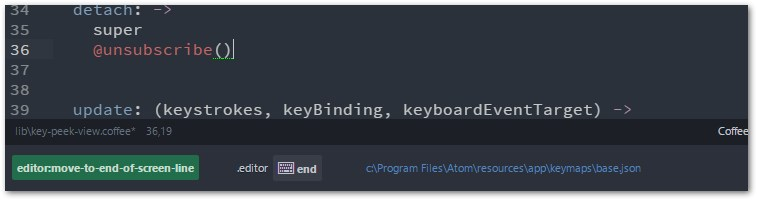
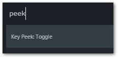

# Key Peek

### What is this?

This is your beloved [Keybinding Resolver](https://atom.io/packages/keybinding-resolver), except:
* It is slimmed down (only shows one line: the matched key binding)
* The different sections are formatted a little prettier.



#### Toggle

Command Palette (`Ctrl-Shift-P`):



By default, this package doesn't get triggered by a key binding, it's up to you to choose one if you wish.
For example, you could override the built-in Keybinding Resolver to use **Key Peek** instead, simply by adding this to your keymap:

```cson
'.workspace':
  'ctrl-.': 'key-peek:toggle'
```

This was meant as an exercise for myself, but I thought others might find it useful, too.
Let me know if you have any problems with it or want to suggest changes.
